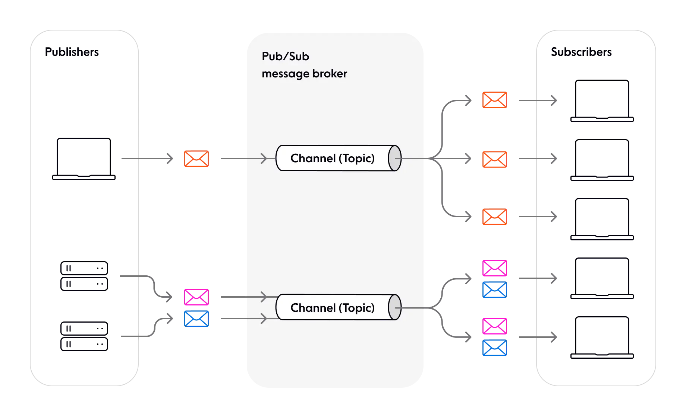

# Kafka #
- Kafka is designed for distributed high throughput systems. Kafka tends to work very well as a replacement for a more traditional message broker. In comparison to other messaging systems, Kafka has better throughput, built-in partitioning, replication and inherent fault-tolerance, which makes it a good fit for large-scale message processing applications.
- Apache Kafka is like a communication system that helps different parts of a
computer system exchange data by publishing and subscribing to topics.
- To be specific, Kafka is used to communicate between different microservices.
Kafka is based on **pub sub model**.

## Pub sub Model ##
- Pub/Sub (or Publish/Subscribe) is an architectural design pattern used in distributed systems for asynchronous communication between different components or services. 
- Pub/Sub provides a framework for exchanging messages between publishers (components that create and send messages) and subscribers (components that receive and consume messages). Note that publishers don’t send messages to specific subscribers in a point-to-point manner. Instead, an intermediary is used - a Pub/Sub message broker, which groups messages into entities called channels (or topics).

;

## Features of Kafka
- **High throughput** - high transaction of data in minimal amount of time.

- **Fault Tolerances (Replication)** - Data is Handled even after error.Kafka follows replication technique, by which the data is copied.

- **Durable** - Data is durable and not lost easily

- **Scalable** 
